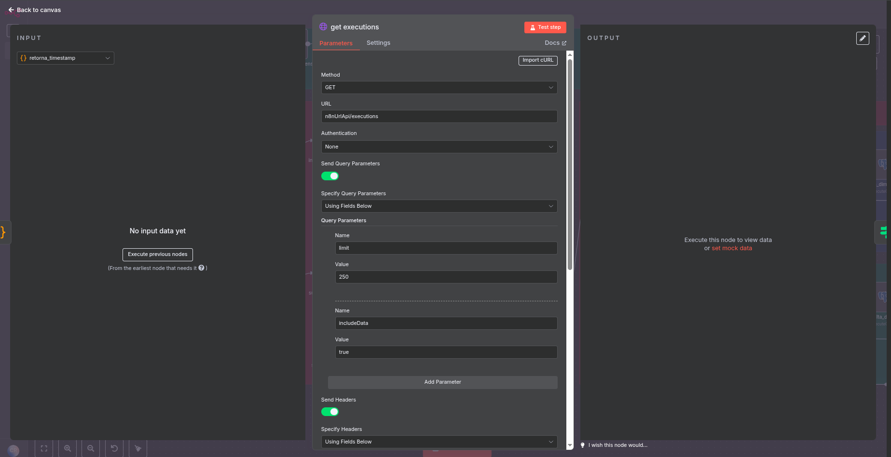
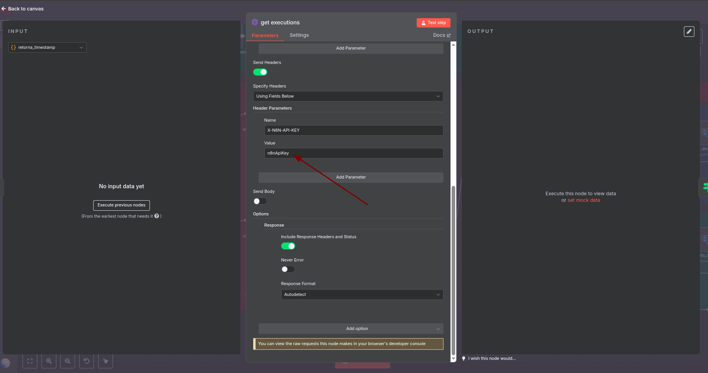
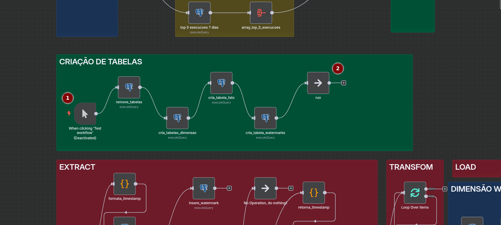
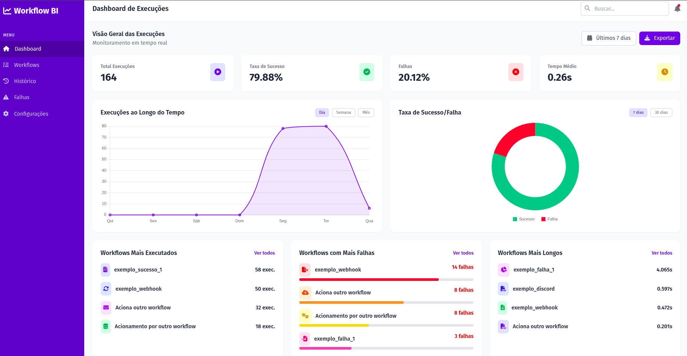

# N8N BI - Dashboard para Monitoramento de Falhas na Ferramenta N8N

## 📊 Visão Geral

O **N8N BI** é um sistema de Business Intelligence completo para monitoramento e análise de execuções de workflows na ferramenta N8N. Este projeto oferece um dashboard interativo que permite visualizar métricas em tempo real, identificar falhas e otimizar performance dos workflows.

### Funcionalidades Principais

- **Monitoramento em Tempo Real**: Coleta automática de dados de execução a cada 10 segundos
- **Dashboard Interativo**: Interface web responsiva com gráficos e métricas
- **Análise de Performance**: Identificação de workflows com mais falhas e maior duração
- **Métricas Detalhadas**: Taxa de sucesso, tempo médio, volume de execuções
- **Modelo Dimensional**: Armazenamento otimizado em PostgreSQL para consultas rápidas

## Arquitetura do Sistema

### ETL (Extract, Transform, Load)
- **Extract**: Coleta dados via API REST do N8N
- **Transform**: Processamento e estruturação em dimensões
- **Load**: Carregamento incremental com controle de watermarks
- **Dashboard**: Interface acessível via navegador para visualizar os dados.


## 🚀 Como Configurar

### Passo 1: Importar o Workflow

1. Copie o JSON do arquivo workflow.json
2. Acesse sua instância do N8N
3. Clique em "Novo Workflow"
4. Cole o conteúdo do arquivo `workflow.json`

### Passo 2: Configurar Credenciais do Banco de Dados

1. No workflow importado, localize os nós PostgreSQL e altere para sua credencial de banco do n8n.

### Passo 3: Configurar API do N8N

#### Alterar URL da API


1. Localize o nó "get executions"
2. No campo **URL**, substitua `n8nUrlApi/executions` pela URL completa da sua API:
   ```
   https://seu-n8n-instance.com/api/v1/executions
   ```

#### Alterar Chave da API


1. No nó "get executions", vá para a aba **Headers**
2. No campo **X-N8N-API-KEY**, substitua `n8nApiKey` pela sua chave de API real
3. Para gerar uma chave de API:
   - Acesse as configurações do N8N
   - Vá para "API Keys"
   - Crie uma nova chave ou use uma existente

### Passo 4: Executar Setup Inicial

1. Localize o trigger "When clicking 'Test workflow'"  e ative-o
2. Localize e clique em "run" para executar o setup inicial
3. Este processo irá:
   - Remover tabelas existentes (se houver)
   - Criar as tabelas dimensionais
   - Criar a tabela fato
   - Configurar o sistema de watermarks

   

### Passo 5: Ativar o Monitoramento Automático

1. O trigger "Cron" já está configurado para executar a cada 10 segundos
2. Para ativar, clique em "Activate" no workflow
3. O sistema começará a coletar dados automaticamente

## 📈 Dashboard

### Acessando o Dashboard


1. Após a configuração, o dashboard estará disponível via webhook
2. Acesse a URL do webhook configurada no nó "Webhook"
3. O dashboard será carregado automaticamente com os dados mais recentes
4. Caso a tela apareça em branco, é por ainda não haver dados suficientes

### Métricas Disponíveis

#### Cards Principais
- **Total Execuções**: Número total de execuções nos últimos 7 dias
- **Taxa de Sucesso**: Percentual de execuções bem-sucedidas
- **Falhas**: Percentual de execuções que falharam
- **Tempo Médio**: Duração média das execuções em segundos

#### Gráficos
- **Execuções ao Longo do Tempo**: Gráfico de linha mostrando volume diário
- **Taxa de Sucesso/Falha**: Gráfico de rosca com percentuais

#### Rankings
- **Workflows Mais Executados**: Top 5 workflows por volume
- **Workflows com Mais Falhas**: Top 5 workflows com maior taxa de erro
- **Workflows Mais Longos**: Top 5 workflows por duração média

## 🔧 Configurações Avançadas

### Intervalo de Coleta
Para alterar o intervalo de coleta de dados:
1. Localize o nó "Cron"
2. Modifique o campo "Seconds Interval" (padrão: 10 segundos)
3. Altere o nó "se_diferença_maior_que_10_segundos" para permitir outra diferença entre as requisições

### Quantidade de itens por requisição
Para diminuir a quantidade de itens buscados por requisição, altere o nó "get executions", modificando o campo limit na query, para reduzir a quantidade de dados coletados.


### Personalização do Dashboard
Para personalizar o visual:
1. Edite o nó "HTML"
2. Modifique o CSS e JavaScript conforme necessário
3. Adicione novas métricas ou gráficos

## 🛠️ Troubleshooting

### Problemas Comuns

#### Erro de Conexão com Banco
- Verifique se o PostgreSQL está rodando
- Confirme as credenciais de acesso
- Teste a conexão manualmente

#### Erro de API do N8N
- Verifique se a URL da API está correta
- Confirme se a chave de API é válida
- Teste a API manualmente via Postman ou curl

#### Dashboard Não Carrega
- Verifique se o webhook está ativo
- Confirme se há dados nas tabelas
- Verifique os logs do N8N

#### Dados Não Atualizam
- Verifique se o trigger cron está ativo
- Confirme se o sistema de watermarks está funcionando
- Verifique se há execuções recentes no N8N

## 📝 Logs e Monitoramento

### Logs do Workflow
- Acesse a aba "Executions" no N8N
- Visualize os logs de cada execução
- Identifique erros e warnings

### Monitoramento de Performance
- Monitore o tempo de execução do workflow
- Verifique o uso de recursos do banco
- Acompanhe o volume de dados coletados

## 🤝 Contribuição

Para contribuir com o projeto:
1. Faça um fork do repositório
2. Crie uma branch para sua feature
3. Implemente as melhorias
4. Envie um pull request

## 📄 Licença

Este projeto está sob a licença MIT. Veja o arquivo LICENSE para mais detalhes.

## 🆘 Suporte

Para suporte e dúvidas:
- Abra uma issue no repositório
- Consulte a documentação do N8N
- Verifique os logs de execução

---

**Desenvolvido com ❤️ para a comunidade N8N**